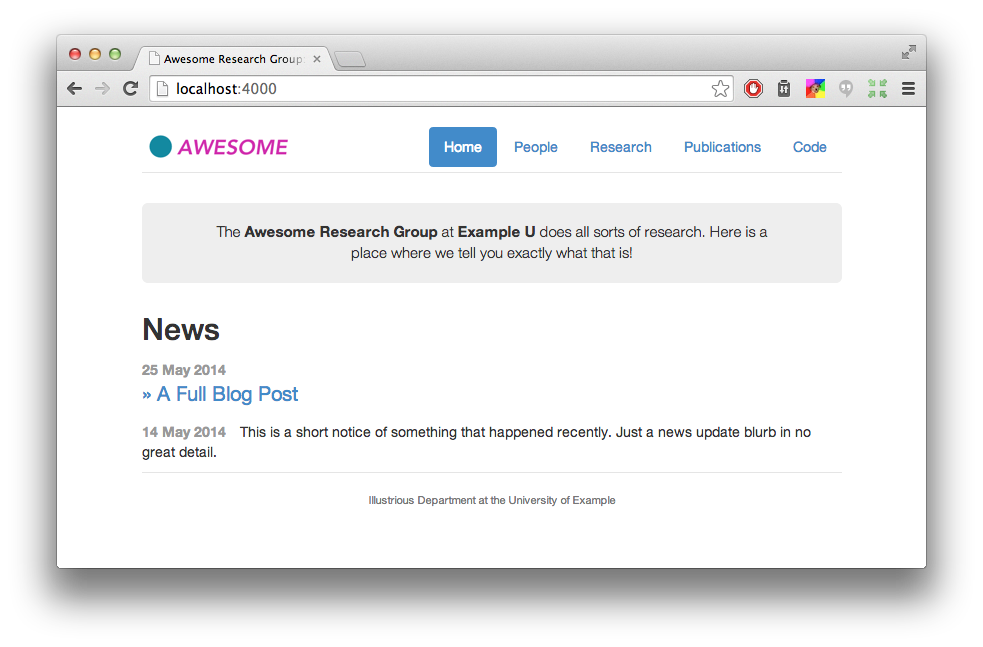

RRG Website Instructions
================================
We have a new website (finally)! The website is built entirely using github actions, so you should only need to edit & commit changes to .yml files in this repository. After you commit changes, a github action (i.e. build) will automatically start, visible on the 'Actions' page of the repository (shown as an action with an orange dot next to it). After about 90sec, the build should be finished (green check mark for success, red x for failure). If you have any issues with a new commit, you can always revert using standard git tools.

There are a few key areas you may want to edit in this website; instructions below.

# To or edit the people in the website:
go to robustrobotics.github.io/_data/people.yml and add another entry to the file. For example, this is Nick's entry:
```
nroy:
    display_name: "Nicholas Roy"
    webpage: "https://aeroastro.mit.edu/people/nicholas-roy/"
    role: faculty
    image: /img/people/nroy.jpg
```

Valid roles are: faculty, staff, scientist, postdoc, grad, ugrad, visitor, and alum. Entries are automatically added to the website based on their assigned role.

You can also edit your entry to include your website or image (pictures should be uploaded to /robustrobotics.github.io/img/people).

# To add a publication to the website:
Go to the file robustrobotics.github.io/_data/bibere/papers.yml and add your entry according to the yaml file structure. Example here:
```
kurtz_prentice_fricra24:
  authors:
  - Martina Stadler Kurtz*
  - Samuel Prentice*
  - Yasmin Veys
  - Long Quang
  - Carlos Nieto-Granda
  - Michael Novitzky
  - Ethan Stump
  - Nick Roy
  links:
  - link: http://groups.csail.mit.edu/rrg/papers/kurtz_prentice_fricra24.pdf
    name: PDF
  raw_string: "@inproceedings{kurtz_prentice_fricra24,\n title={Real-world Deployment\
    \ of a Hierarchical Uncertainty-Aware Collaborative Multiagent Planning System},\n\
    \ author={Kurtz*, Martina Stadler and Prentice*, Samuel and Veys, Yasmin and Quang,\
    \ Long and Nieto-Granda, Carlos and Novitzky, Michael and Stump, Ethan and Roy,\
    \ Nick},\n booktitle={2024 ICRA Workshop on Field Robotics},\n year={2024},\n\
    \ organization={IEEE},\n url = {http://groups.csail.mit.edu/rrg/papers/kurtz_prentice_fricra24.pdf}\n\
    }\n\n"
  title: Real-world Deployment of a Hierarchical Uncertainty-Aware Collaborative Multiagent
    Planning System
  year: 2024
```

Note: The authors, links, title, and year are used to automatically make the entry/text/links on the publications page of the website. The raw_string is what is displayed in the 'BibTex' dropdown on the publications page. Add all additional information  (e.g. organization, etc) to the raw_string param, not in the main yaml entry; otherwise, it will not be included in the bibtex entry (and the website currently does not support including other information on the main publications page). This is because our citations have not been formatted consistently over the last 20+ years...

# To add a research project to the website:
Create a new markdown file in this directory: robustrobotics.github.io/_projects with the same structure as the other files in the directory. After committing the change, the project will automatically be added to the website. Note that you can archive projects (remove them from the home page and add them to the 'Past Projects' section of the Research page) using the 'status: inactive' flag in the project .md.

# To add a news item to the website:
Create a new markdown file in this directory: robustrobotics.github.io/_posts. Note that the first part of the name of the file should be the date of the post.

This site is based on the Research Group Web Site Template, and uses bibere as a publications manager.
================================

This is a [Jekyll][]-based Web site intended for research groups. Your group should be able to get up and running with minimal fuss.

<p align="center">

</p>

This project originated at the University of Washington.  You can see the machinery working live at [our site][sampa].

This work is licensed under a [Creative Commons Attribution-NonCommercial 4.0 International License][license].

[sampa]: http://sampa.cs.washington.edu/
[license]: https://creativecommons.org/licenses/by-nc/4.0/


Features
--------

* Thanks to [Jekyll][], content is just text files. So even faculty should be able to figure it out.
* Publications list generated from BibTeX.
* Personnel list. Organize your professors, students, staff, and alumni.
* Combined news stream and blog posts.
* Easily extensible navigation bar.
* Responsive (mobile-ready) design based on [Bootstrap][].

[Bootstrap]: http://getbootstrap.com/


Setup
-----

1. Install the dependencies. You will need [Python][], [bibble][] (`pip install bibble`), and [Jekyll][] (`gem install jekyll`).
2. [Fork][] this repository on GitHub.
3. Clone the fork to your own machine: `git clone git@github.com:yourgroup/research-group-web.git`.
4. Add an "upstream" remote for the original repository so you can stay abreast of bugfixes: `git remote add upstream https://github.com/uwsampa/research-group-web.git`.
5. Customize. Start with the `_config.yml` file, where you enter the name of the site and its URL.
7. Keep adding content. See below for instructions for each of the various sections.
8. Periodically pull from the upstream repository: `git pull upstream master`.

[Python]: https://www.python.org/
[Fork]: https://github.com/uwsampa/research-group-web/fork


Publication List
----------------

The publications list uses bibere, (https://github.com/ucinlp/bibere/tree/master), a Jekyll-only publications manager, to enable publications updating by editing only .yaml files. See more info on their webpage.

News Items and Blog Posts
-------------------------

For both long-form blog posts and short news updates, we use Jekyll's blogging system. To post a new item of either type, you create a file in the `_posts` directory using the naming convention `YYYY-MM-DD-title-for-url.md`. The date part of the filename always matters; the title part is currently only used for full blog posts (but is still required for news updates).

The file must begin with [YAML front matter][yfm]. For news updates, use this:

    ---
    layout: post
    shortnews: true
    ---

For full blog posts, use this format:

    ---
    layout: post
    title:  "Some Great Title Here"
    ---

And concoct a page title for your post. The body of the post goes after the `---` in either case.

You can also customize the icon that is displayed on the news feed. By default it's `newspaper-o`. We use icons from the [FontAwesome][fa] icon set.

[yfm]: http://jekyllrb.com/docs/frontmatter/
[fa]: http://fontawesome.io/icons/

Projects
--------

To create a project, just create a markdown file in the `_projects` folder. Here are the things you can put in the YAML frontmatter:

- `title:` The project title.
- `notitle:` Set this to `true` if you don't want a title displayed on the project card. Optional.
- `description:` The text shown in the project card. It supports markdown.
- `people:` The people working on the project. This is a list of keys from the `_data/people.yml` file.
- `layout: project` This sets the layout of the actual project page. It should be set to `project`.
- `image:` The URL of an image for the project. This is shown on both the project page and the project card. Optional.
- `last-updated:` Date in the format of `YYYY-MM-DD`. The project cards are sorted by this, most recent first.
- `status: inactive` Set this to `inactive` if don't want the project to appear on the front page. Just ignore it otherwise.
- `link:` Set this to an external URL if this project has a page somewhere else on the web. If you don't have a `link:`, then the content of this markdown file (below the YAML frontmatter) will be this project's page.
- `no-link: true` Set this if you just don't want a project page for your project.

Personnel
---------

People are listed in a [YAML][] file in `_data/people.yml`. You can list the name, link, bio, and role of each person. Roles (e.g., "Faculty", "Staff", and "Students") are defined in `_config.yml`.

[YAML]: https://en.wikipedia.org/wiki/YAML


Building
--------

The website is built entirely using Jekyll with github actions. It is automatically rebuilt every time that you generate a commit.
